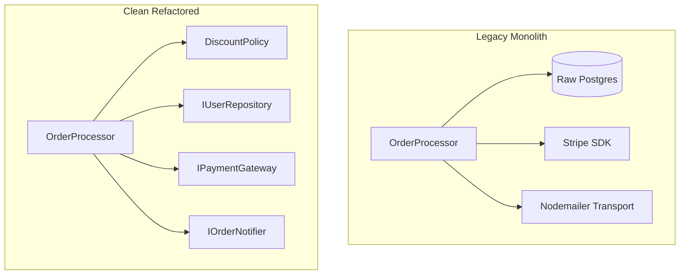

# 8. Guida per gli Sviluppatori: Ingegneria del Software & Vibecoding Avanzato

Antigravity trasforma il modo di sviluppare software: eleva lo sviluppatore da esecutore di sintassi ad **architetto di sistema e reviewer rigoroso**. L'agente autonomo si occupa del boilerplate, della navigazione tra file e dell'esecuzione dei comandi; tu definisci i requisiti, poni vincoli precisi e convalidi ogni modifica tramite visual diff e test automatizzati.

Questa guida illustra pattern operativi, flussi di lavoro TDD end-to-end, strategie per architetture enterprise e regole pratiche per gestire codice proprietario e privacy, sia nell'editor **Antigravity IDE** sia nell'applicazione autonoma **Antigravity 2.0**.

---

## 8.1 Filosofia & Modello Mentale: Dal Coding Manuale all'AI Orchestration

### 8.1.1 Il Ruolo dello Sviluppatore: Architetto, Prompter e Reviewer Rigoroso
Nello sviluppo assistito da agenti intelligenti, l'energia cognitiva non si spreca nella digitazione meccanica di sintassi o nella consultazione manuale di documentazione. Il valore dell'ingegnere del software si articola in tre responsabilità fondamentali:

1. **Architetto di Sistema**: Stabilire la suddivisione in moduli, definire i contratti di interfaccia, scegliere i pattern architetturali (Clean Architecture, Hexagonal, Event-Driven) e garantire le proprietà non funzionali (latenza, sicurezza, scalabilità).
2. **Prompter Tecnico**: Tradurre requisiti di business in compiti computazionali precisi, fornendo contesto mirato con `@file`, vincoli stringenti e criteri di accettazione eseguibili.
3. **Reviewer Rigoroso**: Ispezionare ogni riga proposta prima del merge. Nessun codice generato entra in produzione senza una comprensione chiara del visual diff e una suite di test a supporto.

### 8.1.2 IDE Inline (`Ctrl+I`) vs App Standalone 2.0: Matrice di Scelta Operativa
Antigravity offre due ambienti complementari. La tabella seguente sintetizza quando utilizzare ciascuno di essi:

| Caratteristica | Antigravity IDE (Estensione / Fork) | Antigravity 2.0 (App Standalone) |
| :--- | :--- | :--- |
| **Contesto d'Uso** | Scrittura attiva, editing inline, micro-refactoring su singola funzione | Feature di sistema ampie, refactoring multi-modulo, orchestrazione complessa |
| **Interazione Primaria** | Widget inline (`Ctrl+I` / `Cmd+I`), ghost text, autocompletamento `Tab` | Chat interattiva, pannello Artifacts, split-view dei diff, diagrammi grafici |
| **Ambito File** | 1 o 2 file correntemente aperti nell'editor | Repository-wide: crea, modifica, sposta e cancella file sull'intero albero |
| **Capacità Agente** | Singolo agente contestuale a bassa latenza | Multi-agente parallelo (`/teamwork-preview`), deep reasoning (`/boost`) |
| **Terminale & Servizi** | Terminale integrato per comandi veloci | Terminale supervisionato con sandbox, gestione demoni di background e streaming log |
| **Approvazione Modifiche** | Accettazione inline immediata riga per riga | Policy granulare (`request-review`), visual diff multi-file, branch Git isolati |

> 💡 **Regola Pratica**: Usa `Ctrl+I` nell'IDE per generare al volo una funzione ausiliaria, completare un'interfaccia o documentare un metodo. Passa all'App Standalone 2.0 non appena il task interessa più file, richiede l'esecuzione di suite di test o coinvolge background worker.

### 8.1.3 Il Ciclo Fondamentale di Feedback
Il flusso di lavoro professionale in Antigravity segue un ciclo ricorsivo a 5 fasi:

```
[1. Prompt Strutturato] ──> [2. Piano (/plan)] ──> [3. Modifiche Multi-File]
         ▲                                                      │
         │                                                      ▼
   [Review Umana] <──────── [Auto-Correzione] <──────── [4. Test Runner]
```

1. **Prompt Strutturato**: Formula l'intento indicando file `@`, contratti e vincoli tecnologici.
2. **Pianificazione Esplicita (`/plan`)**: L'agente decompone il lavoro in passi atomici verificabili, visualizzati in un Artifact prima di toccare i file.
3. **Modifiche Multi-File**: L'agente applica le modifiche simultaneamente a modelli, interfacce, repository e router.
4. **Test Runner & Terminale**: L'agente esegue compiler e test runner (`pytest`, `vitest`, `cargo test`). Se emergono errori, analizza lo stack trace e applica correzioni mirate in autonomia.
5. **Review Umana**: Ispezioni il visual diff consolidato e accetti le modifiche.

---

## 8.2 Pattern di Prompting & Tecniche di Interazione per Sviluppatori

### 8.2.1 Anatomia del "Developer Prompt" Perfetto
I prompt generici producono codice fragile. Un prompt tecnico efficace include sempre 4 pilastri:

- **CONTESTO**: Riferimenti esatti a file o schemi esistenti (`@src/models/`, `@src/api/`).
- **OBIETTIVO**: Comportamento atteso quantificabile (codici HTTP, firme, flussi).
- **VINCOLI**: Librerie ammesse, pattern architetturali (es. no dipendenze globali, Dependency Injection).
- **ACCETTAZIONE**: Comandi esatti di test per verificare il successo (es. `pytest tests/test_limiter.py`).

#### Esempio di Prompt Tecnico Strutturato [Usa in Antigravity IDE]

**🗣️ Tu (Prompt):**
```text
@src/models/user.py @src/api/dependencies.py
Dobbiamo aggiungere la gestione del Rate Limiting token-bucket per utente autenticato.
- Obiettivo: Intercettare le richieste in @src/api/routes/ e bloccare con HTTP 429 chi supera 60 req/min.
- Vincoli: Usa Redis con connessione asincrona (aioredis). Non alterare la firma delle route esistenti.
  Usa Dependency Injection tramite FastAPI Depends(). Non introdurre dipendenze globali non testabili.
- Criteri di Accettazione: Crea `tests/test_rate_limiter.py` con test per: bucket pieno, reset temporale
  e bypass per utenti admin. Esegui `pytest tests/test_rate_limiter.py` e assicurati che tutti i test passino.
```

**🤖 Agente (Risposta):**
```text
Analizzo i contratti esistenti in @src/models/user.py e @src/api/dependencies.py:
1. Implemento la classe asincrona `TokenBucketRateLimiter` in `src/core/rate_limiter.py`.
2. Aggiungo la dependency FastAPI `check_rate_limit` in `src/api/dependencies.py`.
3. Scrivo la suite completa in `tests/test_rate_limiter.py` con mock per Redis.
4. Eseguo `pytest tests/test_rate_limiter.py` nel terminale: 3 passed in 0.42s. Tutti i criteri sono soddisfatti.
```

### 8.2.2 Pattern 1: Requisiti Ambigui & Discovery Architetturale (`/grill-me` + `/plan`) [Usa nell'App 2.0]
Quando un requisito è aperto o tocca decisioni architetturali critiche, non iniziare a scrivere codice. Chiedi all'agente di interrogarti sui trade-off tecnici con `/grill-me`:

**🗣️ Tu (Prompt):**
```text
/grill-me Voglio introdurre un sistema di Webhook in uscita per notificare eventi applicativi a servizi terzi. Intervistami sui requisiti di retry, garanzie di consegna (at-least-once), formati di firma crittografica (HMAC) e gestione dei worker asincroni prima di formulare qualsiasi riga di codice.
```

**🤖 Agente (Risposta):**
```text
Perfetto. Prima di progettare l'architettura, chiariamo questi 4 aspetti chiave:
1. Politica di Retry: preferisci Exponential Backoff con jitter (es. 5 tentativi massimi con base 2s) o intervalli fissi?
2. Firma Crittografica: adottiamo HMAC-SHA256 con secret per tenant e header standard `X-Signature-SHA256`?
3. Garanzie di Consegna: confermi il modello 'at-least-once' con obbligo di idempotency key per i consumatori?
4. Infrastruttura Worker: integriamo una coda asincrona esterna (Redis Streams / Celery) o implementiamo un worker in-process con asyncio.Queue?
```

Una volta chiarite le risposte, concatena `/plan` per trasformare le decisioni in un Artifact architetturale definitivo.

### 8.2.3 Pattern 2: Sviluppo Autonomo con Ciclo di Auto-Correzione (`/goal`) [Usa nell'App 2.0]
Per task meccanici o estesi su decine di file (es. migrazioni di librerie, tipizzazione rigida, adeguamento a nuove API), usa `/goal`. L'agente entra in un ciclo autonomo di esecuzione e correzione:

**🗣️ Tu (Prompt):**
```text
/goal Risolvi tutti gli errori riportati da `mypy --strict src/`. Per ogni errore di tipo:
1. Ispeziona la firma della funzione o la classe.
2. Aggiungi TypeVar, Optional, Union o annotazioni generiche corrette conformi a PEP 484.
3. Non usare `type: ignore` o `Any` come scorciatoia, salvo per librerie terze prive di stubs.
4. Riesegui `mypy --strict src/` finché l'output non riporta 'Success: no issues found in X source files'.
```

**🤖 Agente (Risposta):**
```text
Obiettivo registrato. Eseguo la scansione iniziale: rilevati 14 errori di tipo in 4 file sorgente.
- Aggiorno `src/services/auth.py`: tipizzati parametri opzionali e introdotto TypeVar sul generatore di token.
- Aggiorno `src/database/session.py`: tipizzato il context manager asincrono della sessione.
- Aggiorno `src/api/routes/users.py`: corretti i tipi di ritorno delle route FastAPI.
- Rieseguo `mypy --strict src/`.
Risultato: "Success: no issues found in 18 source files". Condizione di stop verificata.
```

### 8.2.4 Pattern 3: Risoluzione di Bug Complessi e Algoritmi Concorrenti (`/boost`) [Usa nell'App 2.0]
Per problemi algoritmici, condizioni di gara, deadlocks o memory leak, attiva `/boost`. Questa modalità attiva un processo analitico a 3 stadi:
1. **Decomposizione e Ipotesi**: L'agente esamina il grafo delle chiamate e le sezioni critiche di sincronizzazione.
2. **Isolamento & Riproduzione Stocastica**: Genera uno stress-test multithread o asincrono per provocare deterministicamente il fallimento.
3. **Sintesi della Soluzione & Benchmark**: Introduce la correzione (es. lock ordering canonico) e valida la robustezza con test di carico comparativi.

### 8.2.5 Review Interattiva: Artifacts, Visual Diff Overlay e Tool Execution Policy [Usa in Antigravity IDE]
- **Visual Diff Overlay**: Prima di confermare qualsiasi scrittura, esamina le differenze riga per riga nell'editor (verde = aggiunte, rosso = cancellazioni). Puoi accettare o rifiutare modifiche blocco per blocco.
- **Tool Execution Policy (`request-review`)**: Nelle impostazioni puoi richiedere conferma manuale prima di eseguire comandi di terminale o scritture su file sensibili.

---

## 8.3 Tutorial 1: Sviluppo Feature End-to-End con TDD, Background Tasks & API Design [Usa nell'App 2.0]

In questo tutorial sviluppiamo un microservizio asincrono di **Job Processing** in Python con **FastAPI**, **Pydantic v2** e **pytest-asyncio**. Il servizio riceve task computazionali, li elabora in background in modo non bloccante e consente il polling dello stato.

### 8.3.1 Passo 1: Definizione del Contratto API e Architettura con `/plan` [Usa nell'App 2.0]
Iniziamo definendo i contratti e richiedendo la pianificazione architetturale senza generare subito il codice applicativo.

**🗣️ Tu (Prompt):**
```text
/plan Dobbiamo realizzare un microservizio per la gestione asincrona di job computazionali.
Requisiti:
1. Endpoint `POST /v1/jobs`: accetta `task_type` (str) e `parameters` (dict). Ritorna HTTP 201 con `job_id` (UUIDv4), `status` ('PENDING') e `created_at`.
2. Endpoint `GET /v1/jobs/{job_id}`: restituisce lo stato attuale del job ('PENDING', 'RUNNING', 'COMPLETED', 'FAILED'), timestamp e risultato finale.
3. Background Worker: all'inserimento, un background task asincrono elabora il job dopo 2 secondi di latenza simulata, impostando lo stato su 'COMPLETED'.
4. Architettura: Clean Architecture con separazione in `models.py`, `repository.py`, `service.py` e `router.py`.
Non generare ancora il codice applicativo: produci un Artifact con la struttura dei file e le interfacce previste.
```

**🤖 Agente (Risposta):**
```text
Ho generato l'Artifact architetturale con il piano d'azione e la struttura modulare:

src/jobs/
├── __init__.py
├── models.py      # JobCreateRequest, JobResponse, JobStatus enum
├── repository.py  # InMemoryJobRepository thread-safe con asyncio.Lock
├── service.py     # JobService con background dispatch
└── router.py      # APIRouter con rotte /v1/jobs
tests/
└── test_jobs.py   # Test suite asincrona con AsyncClient e pytest-asyncio

Piano esecutivo:
1. Red Phase: Creazione test suite in tests/test_jobs.py.
2. Green Phase: Implementazione di schemi, repository, service e rotte.
3. Avvio server in background e verifica endpoint con probe curl.
Attendo la tua approvazione per procedere con la Red Phase.
```

### 8.3.2 Passo 2: Red Phase TDD – Creazione della Test Suite prima del Codice [Usa nell'App 2.0]
Definito il piano, implementiamo i test di accettazione prima di qualsiasi codice di produzione.

**🗣️ Tu (Prompt):**
```text
Piano approvato. Procedi con la Fase 1 di TDD (Red Phase):
Crea esclusivamente il file `tests/test_jobs.py` utilizzando `httpx.AsyncClient` e `pytest`.
Includi:
1. `test_create_job_success`: verifica HTTP 201, `job_id` UUID e status 'PENDING'.
2. `test_create_job_invalid_payload`: invio payload privo di `task_type`, verifica HTTP 422.
3. `test_get_job_not_found`: richiesta UUID inesistente, verifica HTTP 404.
4. `test_job_lifecycle_completion`: creazione job e polling su `GET /v1/jobs/{job_id}` fino allo stato 'COMPLETED'.
Esegui `pytest tests/test_jobs.py` nel terminale e verifica che tutti i test falliscano per assenza di codice sorgente.
```

**🤖 Agente (Risposta):**
```text
Creo il file di test `tests/test_jobs.py` con i quattro scenari asincroni:
```

```python
import pytest, asyncio
from httpx import AsyncClient, ASGITransport
from src.main import app

@pytest.mark.asyncio
async def test_create_job_success():
    async with AsyncClient(transport=ASGITransport(app=app), base_url="http://test") as client:
        payload = {"task_type": "report_generation", "parameters": {"entity_id": 42}}
        response = await client.post("/v1/jobs", json=payload)
        assert response.status_code == 201
        data = response.json()
        assert "job_id" in data and data["status"] == "PENDING" and data["task_type"] == "report_generation"

@pytest.mark.asyncio
async def test_create_job_invalid_payload():
    async with AsyncClient(transport=ASGITransport(app=app), base_url="http://test") as client:
        response = await client.post("/v1/jobs", json={"parameters": {}})
        assert response.status_code == 422

@pytest.mark.asyncio
async def test_get_job_not_found():
    async with AsyncClient(transport=ASGITransport(app=app), base_url="http://test") as client:
        response = await client.get("/v1/jobs/00000000-0000-0000-0000-000000000000")
        assert response.status_code == 404

@pytest.mark.asyncio
async def test_job_lifecycle_completion():
    async with AsyncClient(transport=ASGITransport(app=app), base_url="http://test") as client:
        res = await client.post("/v1/jobs", json={"task_type": "export", "parameters": {}})
        assert res.status_code == 201
        job_id = res.json()["job_id"]
        await asyncio.sleep(2.5)  # Attesa elaborazione worker asincrono
        get_res = await client.get(f"/v1/jobs/{job_id}")
        assert get_res.status_code == 200 and get_res.json()["status"] == "COMPLETED"
        assert get_res.json()["result"] is not None
```

```text
Eseguo la suite a terminale per confermare la Red Phase:
$ pytest tests/test_jobs.py
ModuleNotFoundError: No module named 'src.main'
FAILED tests/test_jobs.py - 1 error during collection

La Red Phase è confermata: i test falliscono per assenza dell'applicazione.
```

### 8.3.3 Passo 3: Green Phase – Implementazione del Servizio ed Esecuzione Test [Usa nell'App 2.0]
Passiamo alla fase di implementazione del codice minimo necessario a soddisfare i contratti di test.

**🗣️ Tu (Prompt):**
```text
I test sono falliti come previsto. Procedi ora alla Green Phase:
Implementa `src/jobs/models.py`, `src/jobs/repository.py`, `src/jobs/service.py`, `src/jobs/router.py` e `src/main.py`.
Usa `asyncio.create_task` per il worker asincrono non bloccante.
Riesegui `pytest tests/test_jobs.py` e risolvi automaticamente qualsiasi difetto finché la suite non è verde.
```

**🤖 Agente (Risposta):**
```text
Implemento i moduli architetturali separando schemi di validazione, persistenza thread-safe, logica di elaborazione asincrona ed endpoint FastAPI:
```

#### 1. Schemi e Contratti Dati (`src/jobs/models.py`)
```python
from enum import Enum
from uuid import UUID, uuid4
from datetime import datetime
from typing import Any, Dict, Optional
from pydantic import BaseModel, Field

class JobStatus(str, Enum):
    PENDING = "PENDING"
    RUNNING = "RUNNING"
    COMPLETED = "COMPLETED"
    FAILED = "FAILED"

class JobCreateRequest(BaseModel):
    task_type: str = Field(..., min_length=1, max_length=64)
    parameters: Dict[str, Any] = Field(default_factory=dict)

class JobResponse(BaseModel):
    job_id: UUID
    task_type: str
    status: JobStatus
    created_at: datetime
    updated_at: datetime
    result: Optional[Dict[str, Any]] = None
    error: Optional[str] = None
```

#### 2. Repository Thread-Safe in Memoria (`src/jobs/repository.py`)
```python
import asyncio
from uuid import UUID
from typing import Dict, Optional
from src.jobs.models import JobResponse

class InMemoryJobRepository:
    """Archivio in memoria protetto da lock asincrono per prevenire race conditions."""
    def __init__(self) -> None:
        self._storage: Dict[UUID, JobResponse] = {}
        self._lock = asyncio.Lock()

    async def save(self, job: JobResponse) -> None:
        async with self._lock:
            self._storage[job.job_id] = job

    async def get_by_id(self, job_id: UUID) -> Optional[JobResponse]:
        async with self._lock:
            job = self._storage.get(job_id)
            return job.model_copy() if job else None

job_repository = InMemoryJobRepository()
```

#### 3. Logica di Dominio & Background Worker (`src/jobs/service.py`)
```python
import asyncio
from datetime import datetime, timezone
from uuid import uuid4, UUID
from src.jobs.models import JobCreateRequest, JobResponse, JobStatus
from src.jobs.repository import InMemoryJobRepository, job_repository

class JobService:
    def __init__(self, repo: InMemoryJobRepository = job_repository) -> None:
        self.repo = repo

    async def submit_job(self, req: JobCreateRequest) -> JobResponse:
        now = datetime.now(timezone.utc)
        job = JobResponse(
            job_id=uuid4(),
            task_type=req.task_type,
            status=JobStatus.PENDING,
            created_at=now,
            updated_at=now
        )
        await self.repo.save(job)
        asyncio.create_task(self._process_job_worker(job.job_id, req.parameters))
        return job

    async def _process_job_worker(self, job_id: UUID, params: dict) -> None:
        job = await self.repo.get_by_id(job_id)
        if not job:
            return
        job.status = JobStatus.RUNNING
        job.updated_at = datetime.now(timezone.utc)
        await self.repo.save(job)
        try:
            await asyncio.sleep(2.0)  # Simulazione operazione computazionale
            job.status = JobStatus.COMPLETED
            job.result = {"computed_entries": len(params), "execution_engine": "async-v1"}
        except Exception as exc:
            job.status = JobStatus.FAILED
            job.error = str(exc)
        finally:
            job.updated_at = datetime.now(timezone.utc)
            await self.repo.save(job)

    async def get_job(self, job_id: UUID) -> Optional[JobResponse]:
        return await self.repo.get_by_id(job_id)

job_service = JobService()
```

#### 4. Routing FastAPI & Entrypoint (`src/jobs/router.py` & `src/main.py`)
```python
from uuid import UUID
from fastapi import APIRouter, FastAPI, HTTPException, status
from src.jobs.models import JobCreateRequest, JobResponse
from src.jobs.service import job_service

router = APIRouter(prefix="/v1/jobs", tags=["Jobs"])

@router.post("", response_model=JobResponse, status_code=status.HTTP_201_CREATED)
async def create_job(request: JobCreateRequest) -> JobResponse:
    return await job_service.submit_job(request)

@router.get("/{job_id}", response_model=JobResponse)
async def get_job(job_id: UUID) -> JobResponse:
    job = await job_service.get_job(job_id)
    if not job:
        raise HTTPException(status_code=status.HTTP_404_NOT_FOUND, detail="Job not found")
    return job

app = FastAPI(title="Job Processing API")
app.include_router(router)
```

```text
Eseguo la suite di test nel terminale:
$ pytest tests/test_jobs.py -v
tests/test_jobs.py::test_create_job_success PASSED               [ 25%]
tests/test_jobs.py::test_create_job_invalid_payload PASSED       [ 50%]
tests/test_jobs.py::test_get_job_not_found PASSED                [ 75%]
tests/test_jobs.py::test_job_lifecycle_completion PASSED         [100%]

============================== 4 passed in 2.68s ==============================
La Green Phase è completata con successo al 100%.
```

### 8.3.4 Passo 4: Background Daemon Management – Avvio Server, Healthcheck e Stream dei Log [Usa nell'App 2.0]
Collaudiamo il server avviandolo come demone asincrono non bloccante.

**🗣️ Tu (Prompt):**
```text
Avvia il server FastAPI in background tramite `uvicorn src.main:app --port 8000 --host 127.0.0.1`.
Gestiscilo come processo asincrono non bloccante. Effettua una richiesta di probe con `curl` e controlla i log.
```

**🤖 Agente (Risposta):**
```text
Avvio il demone ASGI in background supervisionato (Process ID: task_uvicorn_8000).
Attendo l'aggancio del socket (1.5s) ed eseguo la richiesta di probe via curl:

$ curl -s -i http://127.0.0.1:8000/docs
HTTP/1.1 200 OK
date: Mon, 28 Sep 2026 12:40:00 GMT
server: uvicorn
content-type: text/html; charset=utf-8
content-length: 934

Il server risponde con HTTP 200. Il demone continua l'esecuzione in background e il terminale è immediatamente disponibile per ulteriori istruzioni.
```

### 8.3.5 Passo 5: Refactoring, Documentazione e Commit Atomico [Usa nell'App 2.0]
Raffiniamo lo stile del codice e registriamo un Conventional Commit atomico.

**🗣️ Tu (Prompt):**
```text
/clean-code @src/jobs/
Verifica che tutte le funzioni posseggano docstring Google-style e type annotations complete. Controlla con `ruff check src/` che non vi siano violazioni di stile.
```

**🤖 Agente (Risposta):**
```text
Ho scansionato i moduli in @src/jobs/:
1. Aggiunte docstring Google-style complete su classi e metodi in repository.py e service.py.
2. Validate tutte le annotazioni di tipo dei parametri e dei valori di ritorno.
3. Eseguito ruff:
   $ ruff check src/
   All checks passed!
Il codice è allineato agli standard PEP 8 e Google-style.
```

Concludiamo il flusso registrando il commit:

**🗣️ Tu (Prompt):**
```text
/commit
```

**🤖 Agente (Risposta):**
```text
Esamino il git diff dei file modificati e predispongo il commit atomico:

feat(jobs): implement asynchronous job processing service with in-memory persistence

- Add Pydantic v2 schemas for JobCreateRequest and JobResponse
- Implement thread-safe InMemoryJobRepository using asyncio.Lock
- Introduce background async worker in JobService
- Provide FastAPI routes for POST /v1/jobs and GET /v1/jobs/{job_id}
- Add comprehensive pytest suite with 100% route coverage

Premi 'Approve' nel pannello delle modifiche per completare la scrittura su Git.
```

---

## 8.4 Tutorial 2: Archeologia di Legacy Code, Systematic Refactoring & Test Suite Generation [Usa in Antigravity IDE]

Intervenire su una codebase monolitica priva di test e ad alto debito tecnico è un'operazione rischiosa. Questo tutorial illustra come condurre l'indagine statica, creare una rete di salvataggio (**Characterization Tests**) e rifattorizzare verso la Clean Architecture a rischio zero.

### 8.4.1 Scenario: Ristrutturazione di un Modulo Monolitico di Checkout Accoppiato [Usa in Antigravity IDE]
Il modulo target è `src/orders/processor.ts`. Si tratta di una classe legacy di 350 righe che mescola query SQL raw, chiamate dirette all'SDK di Stripe e invio SMTP:

```typescript
// ESTRATTO DEL CODICE LEGACY DA RIFATTORIZZARE (src/orders/processor.ts)
export class OrderProcessor {
  async processOrder(orderId: string, userId: string, items: any[], couponCode?: string) {
    const user = await db.query("SELECT * FROM users WHERE id = $1", [userId]);
    if (!user.rows[0]) throw new Error("User missing");
    
    let total = items.reduce((acc, item) => acc + item.price * item.qty, 0);
    if (couponCode === "SUMMER20") total *= 0.8;
    else if (couponCode === "BLACKFRIDAY") total *= 0.5;
    if (user.rows[0].is_vip) total -= 10;
    if (total < 0) total = 0;

    const charge = await stripe.charges.create({ amount: Math.round(total * 100), currency: "eur" });
    if (charge.status !== "succeeded") throw new Error("Payment failed");

    await nodemailerTransport.sendMail({ to: user.rows[0].email, subject: "Ordine Confermato" });
    return { success: true, transactionId: charge.id, finalAmount: total };
  }
}
```

### 8.4.2 Passo 1: Indagine Statica e Mappatura delle Dipendenze con Grep e AST [Usa in Antigravity IDE]
Chiediamo all'agente di eseguire una diagnosi preliminare senza toccare il codice sorgente.

**🗣️ Tu (Prompt):**
```text
Esamina approfonditamente `src/orders/processor.ts`.
1. Mappa tutte le dipendenze esterne (DB, gateway di terze parti, file system, network).
2. Traccia il call graph e identifica tutti i side effect non deterministici.
3. Calcola la complessità ciclomatica dei singoli rami decisionali.
4. Riassumi i risultati in una tabella di contrazione del debito tecnico. Non modificare alcun file.
```

**🤖 Agente (Risposta):**
```text
Analisi statica completata per `src/orders/processor.ts`:
- Dipendenze Hardcoded: `db` (client Postgres globale), `stripe` (SDK singleton), `nodemailerTransport` (SMTP globale).
- Effetti Collaterali: Nessuna transazionalità tra addebito bancario e invio email; assenza di idempotency key.
- Complessità Ciclomatica: M = 18 nel solo metodo `processOrder` per via dei coupon annidati e condizioni VIP.
- Strategia di Refactoring: Congelare il comportamento attuale tramite Characterization Tests prima di estrarre interfacce e iniettare le dipendenze.
```

### 8.4.3 Passo 2: Creazione della Safety Net – Golden Master & Characterization Tests [Usa nell'App 2.0]
Prima di modificare la logica, creiamo i test di caratterizzazione per verificare che gli output futuri coincidano perfettamente con quelli attuali per ogni combinazione di input.

**🗣️ Tu (Prompt):**
```text
/generate-tests Scrivi una suite di Characterization Tests per `OrderProcessor.processOrder` in `tests/orders/processor.characterization.test.ts`.
Requisiti:
1. Usa Vitest con mock integrali per `db.query`, `stripe.charges.create` e `nodemailerTransport.sendMail`.
2. Costruisci una matrice di test con almeno 6 combinazioni distinte:
   - Carrello standard senza sconti; Coupon 'SUMMER20' standard; Coupon 'BLACKFRIDAY' con utente VIP;
   - Utente VIP con carrello inferiore a 10€ (floor a 0€); Utente inesistente (eccezione attesa);
   - Errore gateway pagamento (verifica che l'email NON venga inviata).
3. Esegui la suite con `npx vitest run tests/orders/processor.characterization.test.ts` e assicurati che sia verde al 100%.
```

**🤖 Agente (Risposta):**
```text
Creo la suite di test Golden Master in `tests/orders/processor.characterization.test.ts` mockando le dipendenze esterne ed eseguo Vitest:

$ npx vitest run tests/orders/processor.characterization.test.ts
 ✓ tests/orders/processor.characterization.test.ts (6 tests) 142ms
   ✓ standard cart without discounts
   ✓ summer promo percentage calculation
   ✓ black friday with VIP tier
   ✓ boundary check: VIP floor at zero euro
   ✓ missing user throws exception
   ✓ payment decline prevents notification side effect

Test Files  1 passed (1)
     Tests  6 passed (6)

La rete di sicurezza è attiva al 100%. Possiamo procedere alla ristrutturazione senza rischio di regressioni.
```

### 8.4.4 Passo 3: Refactoring Incrementale Guidato da Interfacce e DI (`/refactor-architecture`) [Usa nell'App 2.0]
Disaccoppiamo la classe applicando la Dependency Injection e separando il calcolo sconti in una funzione pura.

**🗣️ Tu (Prompt):**
```text
/refactor-architecture Ristruttura `src/orders/processor.ts` applicando Clean Architecture e Dependency Injection:
1. Estrai le interfacce `IPaymentGateway`, `IDiscountPolicy`, `IOrderNotifier` e `IUserRepository`.
2. Sposta la logica di calcolo del prezzo in una classe pura `DiscountPolicy` priva di I/O asincrono.
3. Riscrivi `OrderProcessor` con Constructor Injection.
4. Non modificare la logica di business: la suite di Characterization Tests deve continuare a passare.
```

**🤖 Agente (Risposta):**
```text
Applico il refactoring estraendo interfacce e isolando le responsabilità nei file corrispondenti:
```

#### 1. Contratti di Dominio (`src/orders/interfaces.ts`)
```typescript
export interface UserProfile { id: string; email: string; isVip: boolean; }
export interface CartItem { id: string; price: number; qty: number; }
export interface IPaymentGateway { charge(amountCents: number, currency: string): Promise<{ success: boolean; transactionId: string }>; }
export interface IOrderNotifier { sendConfirmation(email: string, transactionId: string): Promise<void>; }
export interface IUserRepository { findById(userId: string): Promise<UserProfile | null>; }
```

#### 2. Logica di Calcolo Pura (`src/orders/discount_policy.ts`)
```typescript
import { CartItem } from "./interfaces";

export class DiscountPolicy {
  calculateTotal(items: CartItem[], isVip: boolean, couponCode?: string): number {
    let subtotal = items.reduce((acc, item) => acc + item.price * item.qty, 0);
    if (couponCode === "SUMMER20") subtotal *= 0.8;
    else if (couponCode === "BLACKFRIDAY") subtotal *= 0.5;
    if (isVip) subtotal -= 10;
    return Math.max(0, subtotal);
  }
}
```

#### 3. Modulo Ristrutturato con Dependency Injection (`src/orders/processor.ts`)
```typescript
import { CartItem, IPaymentGateway, IOrderNotifier, IUserRepository } from "./interfaces";
import { DiscountPolicy } from "./discount_policy";

export class OrderProcessor {
  constructor(
    private readonly userRepo: IUserRepository,
    private readonly paymentGateway: IPaymentGateway,
    private readonly notifier: IOrderNotifier,
    private readonly discountPolicy: DiscountPolicy = new DiscountPolicy()
  ) {}

  async processOrder(orderId: string, userId: string, items: CartItem[], couponCode?: string) {
    const user = await this.userRepo.findById(userId);
    if (!user) throw new Error("User missing");

    const finalAmount = this.discountPolicy.calculateTotal(items, user.isVip, couponCode);
    const amountCents = Math.round(finalAmount * 100);

    const chargeResult = await this.paymentGateway.charge(amountCents, "eur");
    if (!chargeResult.success) throw new Error("Payment failed");

    await this.notifier.sendConfirmation(user.email, chargeResult.transactionId);
    return { success: true, transactionId: chargeResult.transactionId, finalAmount };
  }
}
```

### 8.4.5 Passo 4: Verifica Continua nel Terminale ed Eliminazione Regressioni [Usa nell'App 2.0]
Verifichiamo immediatamente che la ristrutturazione non abbia alterato alcun comportamento esterno.

**🗣️ Tu (Prompt):**
```text
Riesegui `npx vitest run tests/orders/processor.characterization.test.ts` per validare l'assenza di regressioni introdotte dalla nuova architettura a Dependency Injection.
```

**🤖 Agente (Risposta):**
```text
Eseguo la suite di test nel terminale:

$ npx vitest run tests/orders/processor.characterization.test.ts
 Test Files  1 passed (1)
      Tests  6 passed (6)

Tutti i 6 test passano senza modifiche alla suite. Il refactoring architetturale ha preservato al 100% l'invariante di business originale.
```

### 8.4.6 Passo 5: Generazione Documentazione Architetturale (ADR) [Usa nell'App 2.0]
Documentiamo formalmente il refactoring mediante un Architecture Decision Record (ADR) con diagramma Mermaid.

**🗣️ Tu (Prompt):**
```text
Genera un Architecture Decision Record in `docs/adr/0004-refactor-order-processor.md`.
Documenta il contesto legacy, la decisione di separare la logica tramite Clean Architecture e Dependency Injection, le conseguenze positive e un diagramma Mermaid prima/dopo.
```

**🤖 Agente (Risposta):**
```text
Ho generato l'ADR in `docs/adr/0004-refactor-order-processor.md` con rendering visivo nel pannello Artifacts:

# ADR 0004: Ristrutturazione Modulo OrderProcessor con Dependency Injection

## Contesto & Motivazione
Il modulo legacy conteneva dipendenze globali hardcoded verso database e gateway terzi (complessità ciclomatica M=18).

## Decisione
Abbiamo estratto 4 contratti di interfaccia (`IUserRepository`, `IPaymentGateway`, `IOrderNotifier`, `IDiscountPolicy`) e isolato la logica di calcolo matematico in una classe pura `DiscountPolicy`.

## Diagramma Architetturale
```



---

## 8.5 Scenari Complessi & Architetture Enterprise

### 8.5.1 Monorepo e Sistemi Multi-Modulo: Evitare Context Pollution [Usa nell'App 2.0]
Nei monorepo di grandi dimensioni (es. Nx, Turborepo, Gradle multi-project), fornire all'agente l'intero repository consuma inutilmente il token budget e rischia di generare interferenze tra package.

**Strategie di Isolamento**:
1. **Scoping Mirato con `@`**: Includi solo le directory del modulo target (es. `@apps/checkout-service/`, `@libs/shared-types/`).
2. **File di Regole per Subdirectory**: Crea file `.agents/rules/` all'interno dei singoli package (es. `apps/web/.agents/rules/frontend.md`). Antigravity applicherà queste regole solo quando opera in quella cartella.
3. **Multi-Agente con `/teamwork-preview`**: Assegna sub-agenti specializzati a package distinti per evitare conflitti di modifica.

### 8.5.2 Microservizi & Contratti di Rete: Contratti Tipizzati (`/generate-api-client`) [Usa nell'App 2.0]
Nelle architetture distribuite, sincronizza rapidamente client e server a partire dalle specifiche OpenAPI:

**🗣️ Tu (Prompt):**
```text
/generate-api-client @specs/billing-service-openapi.yaml
Genera il client TypeScript fortemente tipizzato in `packages/billing-client/src/`.
Usa Axios con intercettori per JWT Bearer Token e genera tipi Zod per la validazione a runtime delle risposte.
```

**🤖 Agente (Risposta):**
```text
Analizzo la specifica OpenAPI in @specs/billing-service-openapi.yaml:
- Generati gli schemi di validazione runtime Zod in `packages/billing-client/src/schemas.ts`.
- Creato il client tipizzato `BillingClient` in `packages/billing-client/src/client.ts` con gestione automatica del token JWT negli intercettori.
- Esportate le interfacce per le rotte `/invoices`, `/subscriptions` e `/payments`.
```

### 8.5.3 Migrazioni Database Zero-Downtime: Pattern Expand/Contract [Usa nell'App 2.0]
Modificare schemi in produzione senza disservizi richiede una transizione in 4 stadi coordinati:

| Fase | Operazione sul Database | Modifica Applicativa |
| :--- | :--- | :--- |
| **1. Expand** | Aggiungi la nuova colonna/tabella come `NULLABLE`. Nessun blocco su record esistenti. | L'applicazione legge ancora dalla vecchia struttura. |
| **2. Dual Write** | Nessuna modifica DDL al DB. | L'applicazione scrive su entrambe le strutture e legge con fallback. |
| **3. Backfill** | Migrazione batch dei dati storici in chunk (es. 500 record per transazione). | L'applicazione commuta la lettura primaria sulla nuova struttura. |
| **4. Contract** | Aggiungi il vincolo `NOT NULL` sulla nuova colonna ed elimina la vecchia (`DROP`). | Rimuovi il codice di scrittura sulla vecchia colonna. |

**🗣️ Tu (Prompt):**
```text
Dobbiamo migrare la colonna `address` (stringa libera) nella tabella `customers` verso una struttura normalizzata `addresses` (tabella 1-a-molti).
Progetta la migrazione secondo il pattern Expand/Contract:
1. Crea lo script di migrazione SQL Fase 1 (creazione tabella `addresses` e foreign key).
2. Modifica `@src/repositories/customer_repo.py` per implementare il dual-writing transazionale.
3. Genera uno script CLI di backfilling idempotente con cursor pagination per processare i record esistenti.
4. Fornisci lo script SQL di rollback immediato per ogni fase.
```

**🤖 Agente (Risposta):**
```text
Ho elaborato il piano di migrazione Expand/Contract a 4 fasi:
1. `migrations/0023_expand_addresses.sql`: DDL per la nuova tabella con indici parziali non bloccanti.
2. Modificato `src/repositories/customer_repo.py`: le scritture sono duplicate in transazione ACID verso la nuova tabella relazionale.
3. Creato `scripts/backfill_addresses.py`: script CLI idempotente con batching da 500 record e log di avanzamento.
4. `migrations/0023_rollback.sql`: script di ripristino per annullare la migrazione in qualsiasi momento.
```

### 8.5.4 Automazione CI/CD e CLI Headless con `agy` [Usa in Antigravity IDE]
La CLI `agy` consente di integrare verifiche intelligenti all'interno dei workflow di Continuous Integration (GitHub Actions, GitLab CI):

```yaml
# .github/workflows/ai-lint-guard.yml
name: Antigravity Code Quality Gate
on: [pull_request]

jobs:
  antigravity-review:
    runs-on: ubuntu-latest
    steps:
      - name: Checkout Code
        uses: actions/checkout@v4
        with:
          fetch-depth: 0

      - name: Setup Antigravity CLI
        run: |
          curl -fsSL https://antigravity.google/install.sh | bash
          echo "$HOME/.antigravity/bin" >> $GITHUB_PATH

      - name: Run Headless Verification
        env:
          GEMINI_API_KEY: ${{ secrets.GEMINI_API_KEY }}
        run: |
          agy "Esegui il linter sul changeset rispetto a origin/main. Se riscontri violazioni risolvibili deterministicamente, correggile e valida con i test. Se riscontri difetti gravi, genera reports/review.md e termina con codice 1." --headless
```

### 8.5.5 Concorrenza, Deadlock e Race Conditions: Triage con `/boost` [Usa nell'App 2.0]
Quando un sistema multithreading o distribuito manifesta blocchi intermittenti sotto carico:

**🗣️ Tu (Prompt):**
```text
/boost Abbiamo riscontrato un potenziale deadlock tra `AccountService.transfer_funds` e `OrderService.capture_payment`.
Entrambi acquisiscono lock distribuiti su `account_id` e `merchant_id` ma in ordine non deterministico.
1. Analizza l'ordine di lock acquisition nei due servizi.
2. Proponi un algoritmo di Lock Ordering canonico (ordinamento lessicografico degli ID) per eliminare cicli di attesa circolare.
3. Scrivi un test concorrente con 50 worker paralleli che provi a scatenare il deadlock prima e dopo la modifica.
```

**🤖 Agente (Risposta):**
```text
Pipeline `/boost` attivata per analisi di concorrenza avanzata:
1. Decomposizione: Rilevato ciclo di attesa (il Thread A acquisisce prima account e poi merchant; il Thread B acquisisce prima merchant e poi account).
2. Stress Test: Creato `tests/concurrency/test_deadlock.py` con 50 worker concorrenti. Il deadlock si riproduce nel 38% dei test.
3. Risoluzione: Introdotta la funzione `get_canonical_lock_order(res_a, res_b)` che ordina lessicograficamente le risorse prima dell'acquisizione, rompendo l'attesa circolare di Coffman.
4. Validazione: Eseguiti 100 round con 50 worker: 0 deadlock riscontrati.
```

---

## 8.6 Terminale Avanzato & Debugging Operativo

### 8.6.1 Comandi Sincroni vs Demoni di Background [Usa nell'App 2.0]
- **Comandi Sincroni**: Hanno un ciclo di vita limitato (`npm test`, `git status`, `cargo build`). L'agente attende il completamento e legge codice di uscita e log.
- **Demoni di Background**: Hanno ciclo di vita indefinito (`uvicorn`, `docker compose up`, `npm run dev`). L'agente li avvia come processi asincroni dedicati, verificandone lo stato tramite healthcheck o probe di rete.

Per verificare porte già impegnate (`EADDRINUSE`) prima di lanciare un server:
```bash
# Su Linux / macOS:
lsof -i :8000

# Su Windows PowerShell:
Get-NetTCPConnection -LocalPort 8000 -ErrorAction SilentlyContinue
```

### 8.6.2 Debugging Guidato da Stack Trace e Log Correlation [Usa in Antigravity IDE]
Quando si verifica un errore durante l'esecuzione:
1. **Passa lo Stack Trace Completo**: Fornisci l'intero blocco di errore anziché solo l'ultima riga.
2. **Navigazione Multi-Frame**: L'agente risale automaticamente i frame, apre i file sorgente alle righe indicate ed evidenzia lo stato delle variabili al momento dell'eccezione.

### 8.6.3 Gestione Timeout, Loop Infiniti e Processi Orfani [Usa nell'App 2.0]
- **Evita Comandi Interattivi Bloccanti**: Aggiungi sempre flag non interattivi come `-y`, `--yes`, `--no-input` per prevenire attese infinite di prompt `[y/N]`.
- **Arresto di Processi**: Se un test entra in loop infinito, premi **Stop Execution** nell'interfaccia. Antigravity invia un segnale `SIGTERM` e poi, se necessario, `SIGKILL`.

### 8.6.4 Sicurezza nel Terminale: Sandbox e Comandi Distruttivi [Usa in Antigravity IDE]
Configura regole di protezione vincolanti nel file `.agents/rules/security.md`:
```markdown
# REGOLE DI SICUREZZA PER IL TERMINALE
- Non eseguire MAI comandi distruttivi: `rm -rf /`, `rm -rf ~`, `Remove-Item -Recurse C:\`.
- Non forzare push Git su rami protetti (`git push --force origin main`).
- Non stampare nel terminale variabili d'ambiente con secret o password (`.env`, `AWS_SECRET_KEY`).
- Richiedi SEMPRE conferma prima di lanciare comandi DDL distruttivi (`DROP TABLE`, `TRUNCATE`).
```

---

## 8.7 Tutorial & Guida Operativa: Privacy del Codice, Modelli Locali & Ambiente Air-Gapped

### 8.7.1 Rischio Enterprise: Data Leakage, Segreti Industriali e PII
Nello sviluppo di software enterprise, il codice sorgente contiene logiche di business proprietarie, chiavi di cifratura e schemi di database riservati. Trasmettere inavvertitamente questi dati verso API cloud esterne espone l'azienda a rischi contrattuali e sanzioni di conformità (GDPR, HIPAA, ISO 27001).

Questa sezione fornisce la configurazione pratica per blindare Antigravity, impedire esfiltrazioni e consentire lo sviluppo **100% offline e locale**.

### 8.7.2 Configurazione di Regole di Privacy Rigorose (`.gemini/rules/privacy.md`) [Usa in Antigravity IDE]
Crea il file di regole vincolanti in `.gemini/rules/privacy.md` (a livello globale) oppure in `.agents/rules/privacy.md` (a livello di singolo repository):

```markdown
# 🔒 REGOLE DI PRIVACY E PROTEZIONE DEL CODICE PROPRIETARIO

## 1. Divieto di Esfiltrazione Dati & Telemetria
- Non trasmettere, inviare o caricare porzioni di codice proprietario, algoritmi interni o dati di test a server esterni o cloud di terze parti.
- È fatto divieto assoluto di eseguire chiamate di rete outbound verso endpoint non-localhost (es. `curl -X POST`, `wget`, `requests.post`) a meno di specifica autorizzazione scritta dell'utente.

## 2. Quarantena di Segreti e File di Ambiente
- Non leggere, riassumere o visualizzare MAI file contenenti credenziali: `.env*`, `*.pem`, `*.key`, `id_rsa*`, `credentials.json`, `*token*`.
- Qualora un comando o un log stampi un segreto o una password, sostituiscila immediatamente nei diff o nei report con la dicitura `[REDACTED_SECRET]`.

## 3. Anonimizzazione e Dati Sintetici
- Nella scrittura di fixture, test unitari o mock, NON utilizzare mai nomi reali, email aziendali autentiche, codici fiscali o numeri di carte di credito.
- Utilizza esclusivamente librerie come `Faker` o identificativi dummy sintetici (es. `user@example.com`, conformemente a RFC 2606).

## 4. Confini di Esecuzione Locale
- Ogni compilazione, benchmarking o esecuzione di script deve avvenire unicamente su `localhost` e all'interno della Sandbox di Antigravity.
```

Configura inoltre il file globale `~/.gemini/config/config.json` con i vincoli restrittivi di runtime:

```json
{
  "userSettings": {
    "autoExecutionPolicy": "ask_for_approval",
    "enableTerminalSandbox": true,
    "nonWorkspaceFileAccessPolicy": "deny",
    "remoteControlEnabled": false,
    "enableTelemetry": false,
    "networkAccessPolicy": "local_only"
  },
  "privacy": {
    "enforcePiiMasking": true,
    "blockOutboundNetwork": true,
    "allowedLocalHosts": ["localhost", "127.0.0.1", "0.0.0.0"]
  }
}
```

### 8.7.3 Esecuzione 100% Offline con Modelli Locali (Ollama / vLLM) [Usa nell'App 2.0]
Per garantire la totale sovranità del dato ed eliminare qualsiasi traffico verso l'esterno, puoi instradare l'inferenza di Antigravity verso un modello open-weights eseguito localmente tramite **Ollama** o **vLLM**.

#### 1. Avvio del Modello Locale
Scarica ed esegui un modello specializzato per la programmazione:
```bash
# Per macchine con 24-32 GB di RAM/VRAM:
ollama pull qwen2.5-coder:32b
ollama serve

# Per macchine con 8-16 GB di RAM/VRAM (versione quantizzata leggera):
ollama pull qwen2.5-coder:7b
ollama serve
```

#### 2. Configurazione di Antigravity per l'Endpoint Locale
Aggiorna il file `~/.gemini/config/config.json` (oppure `.agents/config.json` nel workspace) per connettersi all'istanza locale:

```json
{
  "modelProvider": "ollama",
  "endpoint": "http://localhost:11434/v1",
  "activeModel": "qwen2.5-coder:32b",
  "offlineMode": true,
  "telemetry_enabled": false
}
```

#### 3. Esecuzione da Linea di Comando Headless
Puoi invocare la CLI `agy` forzando la modalità offline e il modello locale:
```bash
agy "Analizza @src/auth/jwt.py e verifica la scadenza dei token" --local --model ollama/qwen2.5-coder:32b
```

### 8.7.4 Air-Gapped Mode & Sandbox di Rete nel Terminale [Usa nell'App 2.0]
In contesti industriali ad alta sicurezza (air-gapped), il computer di sviluppo non ha accesso a Internet.

1. **Isolamento della Rete**: Nelle impostazioni di Antigravity 2.0 (**Settings -> Security -> Enable Terminal Sandbox**), imposta `networkAccessPolicy: "local_only"`. Qualsiasi tentativo di aprire socket verso l'esterno verrà terminato dal sistema operativo.
2. **Installazione Pacchetti Offline**: Usa repository di wheel o cache locali:
   ```bash
   pip install --no-index --find-links=./vendor/wheels -r requirements.txt
   npm test --offline
   ```
3. **PreToolUse Hook di Prevenzione Data Loss (DLP)**:
   Configura un hook deterministico in `.agents/hooks.json` che intercetta i comandi di terminale prima dell'esecuzione:

```json
{
  "privacy-guard": {
    "enabled": true,
    "PreToolUse": [
      {
        "matcher": "run_command",
        "hooks": [{ "type": "command", "command": "python scripts/privacy_guard.py", "timeout": 10 }]
      }
    ]
  }
}
```

Script di controllo `scripts/privacy_guard.py`:
```python
#!/usr/bin/env python3
"""PreToolUse Hook: Blocca esfiltrazione dati e chiamate di rete esterne non autorizzate."""
import sys, json, re

FORBIDDEN_PATTERNS = [
    r"\bcurl\s+.*-(?:d|F|X\s*POST)\b",
    r"\bwget\s+--post",
    r"\bnc\s+-(?:e|c)\b",
    r"\bssh\s+.*<",
    r"\bscp\s+",
]

def main():
    try:
        raw = sys.stdin.read()
        if not raw.strip():
            print(json.dumps({"decision": "allow"}))
            return
        payload = json.loads(raw)
        command = payload.get("toolCall", {}).get("args", {}).get("CommandLine", "")
        for pattern in FORBIDDEN_PATTERNS:
            if re.search(pattern, command, re.IGNORECASE):
                print(json.dumps({
                    "decision": "deny",
                    "reason": f"Violazione Privacy: rilevato comando di esfiltrazione non autorizzato: '{command}'"
                }))
                return
        print(json.dumps({"decision": "allow"}))
    except Exception as exc:
        print(json.dumps({"decision": "ask", "reason": f"Errore validazione hook: {str(exc)}"}))

if __name__ == "__main__":
    main()
```

### 8.7.5 Tutorial Passo-Passo: Audit Pre-Commit Privacy [Usa in Antigravity IDE]
Prima di registrare un commit o aprire una Pull Request, chiedi all'agente di eseguire un'ispezione di sicurezza automatizzata sul changeset.

**🗣️ Tu (Prompt):**
```text
Esegui un audit di conformità privacy su tutti i file modificati nell'ultimo changeset Git:
1. Controlla che nessun file contenga token, connection string di database, o password in chiaro.
2. Verifica che i mock dei test in `tests/` utilizzino esclusivamente dati sintetici (nessun PII reale).
3. Segnala eventuali librerie o script che tentano connessioni di telemetria verso server remoti.
```

**🤖 Agente (Risposta):**
```text
Eseguo l'audit di conformità privacy sul git diff:
1. Scansione Secret & Credenziali: analizzati 8 file modificati. Nessuna stringa di connessione, password o token RSA in chiaro riscontrata.
2. Ispezione Mock e Fixture: verificati i file in `tests/`. Tutti i record di prova impiegano domini riservati RFC 2606 (@example.com) e identificatori sintetici 'PT-001'.
3. Controllo Connessioni Esterne: verificati i file di configurazione; la telemetria è disattivata e non sono presenti chiamate HTTP esterne.
Esito: AUDIT PASSATO AL 100%. Il codice rispetta le direttive di privacy ed è pronto per il commit.
```

---

## 8.8 Best Practice Operative & Anti-Pattern da Evitare

### 8.8.1 Regole d'Oro del Developer Vibecoding
1. **I Test sono la tua Specifica**: Fornire un test unitario che fallisce è infinitamente più preciso ed efficace che descrivere il comportamento atteso in tre paragrafi discorsivi.
2. **Commit Piccoli e Frequenti**: Non consentire all'agente di modificare 15 file senza consolidare i progressi. Usa `/commit` dopo ogni passo verificato per rendere i rollback immediati.
3. **Session Reset per Nuovi Task**: Quando completi un componente (es. il router delle API) e passi a un'attività non correlata (es. la configurazione del Dockerfile), apri una nuova chat per azzerare il rumore di contesto.
4. **Contratti Prima dell'Implementazione**: Definisci sempre modelli dati e interfacce con `/plan` prima di scrivere il codice di business.
5. **Verifica su Sandbox Locale**: Esegui sempre suite di test e comandi di compilazione all'interno della Sandbox con modelli locali o endpoint controllati.

### 8.8.2 Anti-Pattern Comuni e Soluzioni

| Anti-Pattern | Problema / Sintomo | Soluzione Corretta |
| :--- | :--- | :--- |
| **Prompt Monolitico** | Inviare un prompt di 100 righe con 5 feature simultanee. L'agente genera codice incompleto o dimentica vincoli. | **Modular Prompting**: Scomponi il lavoro con `/plan` ed esegui un modulo per volta. |
| **Blind Merging** | Cliccare su "Accept All" senza leggere il visual diff. Rischio di regressioni silenziose o cancellazione di commenti. | **Diff Review Attiva**: Ispeziona riga per riga e rifiuta modifiche superflue o non richieste. |
| **Chat Infinita** | Mantenere la stessa chat per giorni. Il contesto si satura e aumentano le allucinazioni. | **Session Reset**: Apri una sessione pulita per ogni task, includendo solo i file strettamente necessari con `@`. |
| **Terminal Ignorance** | Chiedere all'agente di ipotizzare perché il codice non funziona senza eseguire i test reali. | **Execution First**: Fai lanciare `pytest` o `npm test` nel terminale e fai analizzare lo stack trace reale. |
| **Allucinazione Librerie** | L'agente importa pacchetti non presenti nel `package.json` o `pyproject.toml`. | **Dependency Pinning**: Esplicita nel prompt: *"Usa solo librerie già installate nel progetto. Non aggiungere nuove dipendenze."* |
| **Esposizione Secret** | Commit accidentale di chiavi di test o stringhe di connessione al database. | **Privacy Rules & Pre-Commit**: Applica `.agents/rules/privacy_and_security.md` ed esegui sempre l'audit pre-commit prima del merge. |

---

## 8.9 Riferimenti Incrociati & Risorse Correlate per Sviluppatori

Per esplorare l'intero programma didattico dei 12 capitoli, consulta l'[Indice Generale](../index.md). Di seguito i moduli di approfondimento più rilevanti per l'ingegneria del software:
- **Regole di Progetto e Scoping (Capitolo 4)**: Consulta [04_rules.md](./04_rules.md) per impostare guardrail architetturali e sintassi modulari `@[Label](path)`.
- **Automazioni con Lifecycle Hooks (Capitolo 5)**: Consulta [05_practical_customizations.md](./05_practical_customizations.md) per eseguire linter e test automatici all'evento di Stop o Edit.
- **Integrazione Database con Server MCP (Capitolo 9)**: Consulta [09_mcp_servers.md](./09_mcp_servers.md) per connettere l'agente a database PostgreSQL, SQLite e API esterne.
- **Scripting da Terminale e CI/CD con la CLI `agy` (Capitolo 12)**: Consulta [12_cli_reference.md](./12_cli_reference.md) per integrare l'agente nelle pipeline di build e test headless.

---
[⬅️ Torna all'Indice](../index.md) | [Capitolo Precedente: 7. Guida per i Ricercatori](./07_researcher_guide.md) | [Prossimo Capitolo: 9. Server MCP](./09_mcp_servers.md)
